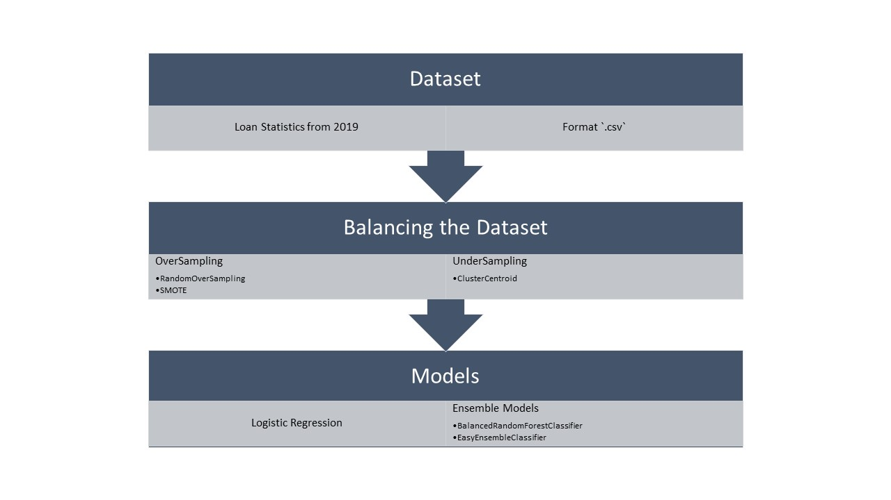
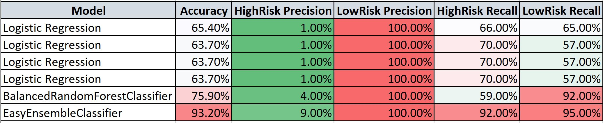
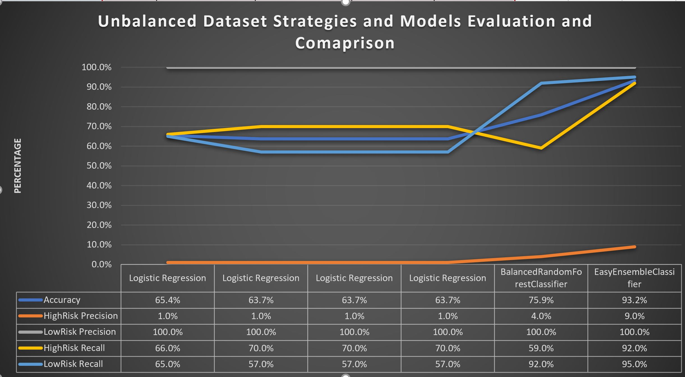

# Credit Risk Analysis
## Overview of the Analysis:

Purpose of this exercise is to evaluate credit card risk analysis for the loan purposes. Unfortunately, there is very less data related to the risky loan situation and plenty for the good credit. 

### Data Distribution per class 

### Data Cleaning:
It is important to prepare the dataset for the training purposes. Besides all basic data cleaning (code already existed), oneHotEncoding for the categorical data is done using `pd.dummies` function. 

### Evaluation Tools:

Through this excercise, various strategies related to unbalanced datasets are used and evaluated in term of 
- Precision
- Recall
- Accuracy
- Confusion Matrix. 

## Results: 

## Summary
 
